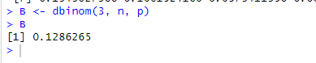

# Praktikum Probstat Modul 1

## Identitas

| Nama          | NRP           | Kelas |
| ---           | ---           | ---   |
| Nadif Mustafa | 5025211127    | C     |

## Soal 1

> **Probabilitas seorang bayi lahir laki-laki = 0.488
Terdapat 10 kelahiran**

### 1A

> **Bagaimana pendistribusian banyak bayi laki-laki? Tentukan distribusi dengan parameter yang sesuai**

Distribusi yang digunakan adalah Distribusi Binomial dengan parameter `n = 10` dan `p = 0.488`. Untuk menghitung Distribusi Binomial di R bisa menggunakan fungsi `dbinom()` seperti berikut :

```R
p = 0.488
n = 10
x = 0:10

# A
# Pendistribusian banyak bayi laki-laki
# Menggunakan Distribusi Binomial, karena hanya ada 2
# kemungkinan kejadian, yaitu laki-laki atau perempuan
A <- dbinom(x, n, p)
A
```

Berikut adalah hasilnya :


### 1B

> **Probabilitas tepat 3 bayi adalah laki-laki**

Karena yang diminta adalah tepat 3, maka cukup gunakan fungsi `dbinom()` seperti di atas, dengan nilai `x` diganti menjadi 3 seperti berikut :

```R
# B
# Probabilitas tepat 3 bayi adalah laki-laki
B <- dbinom(3, n, p)
B
```

Berikut adalah hasilnya :



### 1C

> **Probabilitas kurang dari 3 adalah bayi laki-laki**

Karena yang diminta kurang dari 3, maka sama saja dengan menghitung Kumulatif hingga 2, sehingga bisa menggunakan fungsi `pbinom()` seperti berikut :

```R
# C
# Probabilitas kurang dari 3 bayi adalah laki-laki
C <- pbinom(2, n, p)
C
```

Berikut adalah hasilnya :


### 1D

> **Probabilitas 3 atau lebih bayi adalah laki-laki**

Karena yang diminta adalah 3 atau lebih, maka sama saja dengan Kumulatif Total (bernilai 1) dikurangi dengan Kumulatif hingga 2, karena nilai Kumulatif sudah dikerjakan sebelumnya pada subsoal C, maka bisa langsung ditulis sebagai berikut :

```R
# D
# Probabilitas 3 atau lebih bayi adalah laki-laki
D <- 1 - C
D
```

Berikut adalah hasilnya :


### 1E

> **Nilai Harapan dan Simpangan Baku banyak bayi laki-laki**

Nilai Harapan dari Distribusi Binomial adalah perkalian jumlah percobaan dengan kemungkinan sukses.
Pada soal ini, jumlah percobaan `n = 10` dan kemungkinan sukses `p = 0.488`.
Sehingga nilai harapannya adalah `10 * 0.488 = 4.88`.

Nilai Simpangan Baku dari Distribusi Binomial adalah akar dari variannya.
Niali Varian dari Distribusi Binomial adalah perkalian antara jumlah percobaan, kemungkinan sukses, dan kemungkinan gagal.
Maka nilai simpangan baku adalah `sqrt(10 * 0.488 * (1 - 0.488)) = 1.580683`

Berikut adalah scriptnya :

```R
# E
# Nilai Harapan dan Simpangan Baku banyak bayi laki-laki
nilai_harapan <- n * p
simp_baku <- sqrt(n * p * (1 - p))
nilai_harapan
simp_baku
```

Berikut adalah hasilnya :


### 1F

> **Histogram pendistribusian banyak bayi laki-laki**

Berikut adalah scriptnya :

```R
# F
# Histogram pendistribusian banyak bayi laki-laki
plot(x, dbinom(x, n, p), type = 'h', lwd = 3,
     main = "Distribui Banyak Bayi Laki-Laki",
     xlab = "Jumlah bayi laki-laki", ylab = "Probabilitas")
```

Berikut adalah hasilnya :


## Soal 2

> **Banyak kematian karena kanker tulang untuk seluruh pekerja dalam 20 tahun ke depan adalah 1.8**

### 2A

> **Pendistribusian banyak kematian karena kanker tulang, serta tentukan distribusi dengan parameter yang sesuai**

Distribusi yang digunakan adalah Distribusi Poisson dengan parameter `lambda = 1.8`.

### 2B

> **Probabilitas 4 kematian akibat kanker tulang**

Untuk menghitung Distribusi Poisson di R bisa menggunakan fungsi `dpois()` seperti berikut :

```R
# A
# Menggunakan Distribusi Poisson
lambda = 1.8

# B
# Probabilitas 4 kematian kanker tulang (Tidak Biasa)
B <- dpois(4, lambda)
B
```

Berikut adalah hasilnya :


### 2C

```R
# C
# Peluang paling banyak 4 kematian kanker tulang
C <- ppois(4, lambda)
C
```

Berikut adalah hasilnya :


### 2D

```R
# D
# Peluang lebih dari 4 kematian kanker tulang
D <- 1 - C
D
```

Berikut adalah hasilnya :


### 2E

```R
# E
# Nilai Harapan dan Standar Deviasi kematian kanker tulang
nilai_harapan <- lambda
sd <- lambda
nilai_harapan
sd
```

Berikut adalah hasilnya :


### 2F

```R
# F
# Histogram Pendistribusian kematian kanker tulang
plot(0:10, dpois(0:10, lambda), type = 'h', lwd = 3,
     main = "Distribusi banyak kematian akibat kanker tulang",
     xlab = "Jumlah Kematian", ylab = "Probabilitas")
```


## Soal 3

### 3A

```R
x = 3
v = 10

# A
# Fungsi Probabilitas Distribusi Chi-Square
dchisq(x, v)
```

Berikut adalah hasilnya :


### 3B

```R
# B
# Histogram dari Distribusi Chi-Square dengan 500 data acak
hist(rchisq(n = 500, df = v), main = "Histogram Distribusi Chi-Square",
     xlab = "Nilai", ylab = "Frekuensi")
```

Berikut adalah hasilnya :


### 3C

```R
# C
# Rataan dan Varian Distribusi Chi-Square
mean <- v
varian <- 2 * v
mean
varian
```

Berikut adalah hasilnya :


## Soal 4

### 4A

### 4B

### 4C

## Soal 5

> **Kerjakan soal-soal berikut menggunakan Distribusi T-Student**

Pada nomor ini cukup kerjakan dengan menggunakan fungsi `pt()` dan `qt()`

### 5A

> **Probabilitas peristiwa acak X kurang dari -2.34 dengan 6 derajat kebebasan**

Berikut adalah scriptnya :

```R
# A
pt(q = -2.34, df = 6)
```

### 5B

> **Probabilitas peristiwa acak X lebih dari 1.34 dengan 6 derajat kebebasan**

Berikut adalah scriptnya :

```R
# B
pt(q = 1.34, df = 6, lower.tail = FALSE)
```

### 5C

> **Probabilitas peristiwa acak X kurang dari -1.23 atau lebih besar dari 1.23 dengan 3 derajat kebebasan**

Berikut adalah scriptnya :

```R
# C
pt(q = -1.23, df = 3) + pt(q = 1.23, df = 3, lower.tail = FALSE)
```

### 5D

> **Probabilitas peristiwa acak X berada di antara -0.94 dan 0.94 dengan 14 derajat kebebasan**

Berikut adalah scriptnya :

```R
# D
pt(q = 0.94, df = 14) - pt(q = -0.94, df = 14)
```

### 5E

> **Nilai t-score dengan 5 derajat kebebasan yang memiliki luasan 0.0333 satuan persegi di bawah kurva dan di sebelah kiri t-score**

Berikut adalah scriptnya :

```R
# E
qt(p = 0.333, df = 5)
```

### 5F

> **Nilai t-score dengan 25 derajat kebebasan yang memiliki luasan 0.125 satuan persegi di bawah kurva dan di sebelah kanan t-score**

Berikut adalah scriptnya :

```R
# F
qt(p = 0.125, df = 25, lower.tail = FALSE)
```

### 5G

> **Nilai t-score dengan 11 derajat kebebasan yang memiliki luasan 0.75 satuan persegi di bawah kurva dan di antara t-score tersebut dan negatif dari nilai t-score**

Berikut adalah scriptnya :

```R
# G
qt(p = 0.875, df = 11)
```

### 5H

> **Nilai t-score dengan 23 derajat kebebasan yang memiliki luasan 0.0333 satuan persegi di bawah kurva dan di luar interval antara t-score dan negatif dari nilai t-score**

Berikut adalah scriptnya :

```R
# H
qt(p = 0.98335, df = 23)
```

### Hasil


